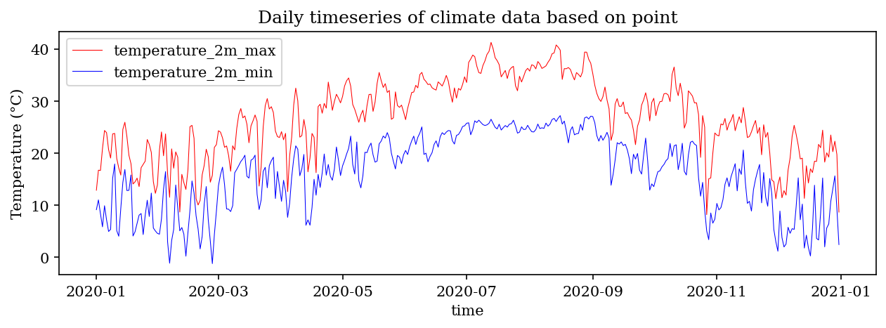

# Welcome to geeagri

[](https://colab.research.google.com/github/geonextgis/geeagri/blob/main)
[](https://mybinder.org/v2/gh/geonextgis/geeagri/main?labpath=notebooks%2Fintro.ipynb)
[](https://studiolab.sagemaker.aws/import/github/geonextgis/geeagri/blob/main/notebooks/intro.ipynb)
[](https://pypi.org/project/geeagri)
[](https://pepy.tech/project/geeagri)
[](https://geonextgis.github.io/geeagri)
[](https://opensource.org/licenses/MIT)

<div align="center">
  <a href="https://geonextgis.github.io/geeagri">
    
  </a>
</div>

**A Python package for agricultural monitoring and analysis using Google Earth Engine**

- GitHub repo: <https://github.com/geonextgis/geeagri>
- Documentation: <https://geonextgis.github.io/geeagri>
- PyPI: <https://pypi.org/project/geeagri>
- Notebooks: <https://github.com/geonextgis/geeagri/tree/main/docs/examples>
- License: [MIT](https://opensource.org/licenses/MIT)

---

## Introduction

**geeagri** is a Python package that integrates the power of [Google Earth Engine (GEE)](https://earthengine.google.com/) with domain-specific agricultural analysis. It enables scalable processing, downloading, and visualization of satellite data for crop monitoring, yield estimation, and agro-environmental assessment.

This package builds upon geospatial tools like [`geemap`](https://github.com/gee-community/geemap) and simplifies workflows for scientists, researchers, and policymakers working in agriculture. Whether you're interested in vegetation monitoring, drought assessment, phenology extraction, or productivity mapping, **geeagri** offers tools and prebuilt pipelines to make your analysis easier and faster.

**geeagri** is ideal for:

- Researchers working with satellite-derived agricultural indicators.
- Practitioners and analysts from development, environmental, and governmental organizations.
- Students and educators looking to learn remote sensing for agriculture.

For a complete list of examples and use cases, visit the [notebooks](https://github.com/geonextgis/geeagri/tree/main/docs/examples) section.

---

## Key Features

* **Long-term Time Series Extraction** — Retrieve satellite or climate time series from Google Earth Engine (GEE) for both point and polygon geometries.
* **Image Patch Generation** — Extract image tiles or patches from satellite imagery in GEE to support local-scale computer vision or deep learning model training.
* **Multivariate Dimensionality Reduction** — Transform complex multivariate datasets into a few principal components while preserving essential information using PCA.
* **Harmonic Regression Analysis** — Easily perform harmonic regression on vegetation or climate indices to study seasonal and periodic trends.
* **Cloud-free Time Series Creation** — Generate regular, gap-filled, and cloud-free time series from irregular satellite observations.
* **Phenology and Smoothing Tools** — Apply smoothing algorithms and extract phenological metrics (Start of Season, Peak of Season, End of Season) from high-resolution satellite data.

---

## Installation
```bash
conda create -n geeagri python=3.10
conda activate geeagri
pip install geeagri
# (Optional) Upgrade to the latest version if already installed
pip install --upgrade geeagri
```

---

## Example Usage

#### Example 1: Extract timeseries to point
```python
import ee
import geeagri
from geeagri.extract import extract_timeseries_to_point

# Authenticate and initialize the Earth Engine API
ee.Authenticate()
ee.Initialize()

# Define point location (longitude, latitude)
lon, lat = -98.15, 30.50
point = ee.Geometry.Point([lon, lat])

# Load ERA5-Land daily aggregated climate dataset
era5_land = ee.ImageCollection("ECMWF/ERA5_LAND/DAILY_AGGR")

# Extract daily temperature, precipitation, and solar radiation time series
era5_land_point_ts = extract_timeseries_to_point(
    lat=lat,
    lon=lon,
    image_collection=era5_land,
    start_date="2020-01-01",
    end_date="2021-01-01",
    band_names=[
        "temperature_2m_min",
        "temperature_2m_max",
        "total_precipitation_sum",
        "surface_solar_radiation_downwards_sum",
    ],
    scale=11132,  # spatial resolution in meters (~11 km)
)
```
This example demonstrates how to use `geeagri` to extract daily climate variable time series (temperature, precipitation, and solar radiation) from the **ERA5-Land** dataset at a specific geographic point using the Google Earth Engine (GEE) Python API.

**Output Plot:**


#### Example 2: Create regular satellite timeseries
```python
import ee
from geeagri.preprocessing import Sentinel2CloudMask, RegularTimeseries

# Authenticate and initialize the Earth Engine API
ee.Authenticate()
ee.Initialize()

# Define the bounding box
bbox = [-98.451233, 38.430732, -98.274765, 38.523996]
region = ee.Geometry.BBox(*bbox)

# Get cloud masked Sentinel-2 image collection
s2_cloud_masker = Sentinel2CloudMask(
    region=region,
    start_date="2020-01-01",
    end_date="2021-01-01",
    cloud_filter=60,  
    cloud_prob_threshold=50,
    nir_dark_threshold=0.15,
    shadow_proj_dist=1,  
    buffer=50
)

s2_cloud_masked = s2_cloud_masker.get_cloudfree_collection()

# Calculate NDVI
def calculateNDVI(image):
    ndvi = image.expression(
        "(NIR - Red) / (NIR + Red)",
        {"NIR": image.select("B8"), "Red": image.select("B4")},
    ).copyProperties(image, ["system:time_start"])

    ndvi = ee.Image(ndvi).rename("ndvi").clip(region)

    return ndvi


ndvi_col = s2_cloud_masked.map(calculateNDVI)

# Instantiate a 'RegularTimeseries' object
reg_timeseries = RegularTimeseries(
    image_collection=ndvi_col,
    interval=5,  # Interval (in days) between consecutive target dates
    window=45,  # Temporal window in days
)

# Get the regular timeseries
ndvi_regular = reg_timeseries.get_regular_timeseries()
```
This example demonstrates how to extract a regular, gap-filled NDVI time series from Sentinel-2 imagery using `geeagri`. First, a `Sentinel2CloudMask` object is created to mask clouds and shadows over a defined bounding box using thresholds for cloud probability, dark NIR pixels, and shadow projection. The cloud-masked images are then processed with a custom function to calculate NDVI for each image. Finally, a `RegularTimeseries` object generates a temporally consistent NDVI time series at a specified interval and temporal window. This workflow allows users to efficiently obtain high-quality, regular NDVI time series from raw Sentinel-2 imagery while handling cloud and shadow contamination.

**Raw NDVI Time Series with Cloud Gaps:**


**Regular Gap-filled NDVI Time Series:**


---